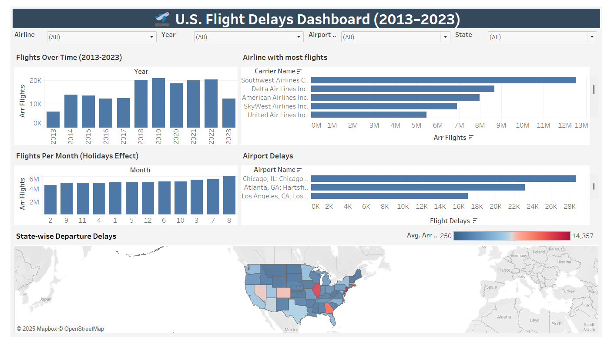

# ✈️ U.S. Airline Flight Delays Analysis (2013-2023)  

📊 **An interactive Tableau dashboard analyzing U.S. flight delays (2013-2023).**  

🔗 **Live Dashboard on Tableau Public**: [View Here](https://public.tableau.com/views/U_S_FlightDelaysAnalysis2013-2023/U_S_FlightDelaysDashboard2013-2023?:language=en-GB&:sid=&:redirect=auth&:display_count=n&:origin=viz_share_link)

---

##  Project Overview  
This project involves analyzing **10 years of U.S. flight delays** to uncover delay patterns, seasonal trends, and airline performance. Using **Tableau**, the analysis highlights:  
- Flight volume trends over time  
- Seasonal flight patterns (holidays, peak seasons)  
- Airline performance  
- Airport delays  
- State-wise departure delays  

The dashboard is interactive and allows users to explore the data by airline, year, month, state, and more.

## 📊 Key Insights  
1. **Flight Volume Trends:**  
   - Significant **drop in 2020** due to COVID-19, followed by a recovery.  
   
2. **Holiday Effects:**  
   - Flight volumes decrease around **Thanksgiving and Christmas**.  
   
3. **Airline Performance:**  
   - **Southwest Airlines**, **Delta**, and **American Airlines** operate the most flights.  
   
4. **Airport Delays:**  
   - Airports like **Atlanta (ATL)** and **Chicago (ORD)** see the most delays.  
   
5. **State-wise Departure Delays:**  
   - Some states like **California and New York** experience longer delays than others.  

## 🛠️ Tools Used  
- **Tableau**: Data visualization and dashboard creation  
- **Excel**: For initial data exploration and cleaning  

## 📂 Project Files  
📊 `US-Flight-Delays-Analysis-2013-to-2023.twbx` → Tableau workbook  

## 🚀 How to Use This Dashboard?  
1. **Download** the Tableau Workbook (`.twbx`).  
2. Open the workbook in **Tableau Public** (free version) or **Tableau Desktop**.  
3. Use the **filters & interactive elements** to explore the data.

